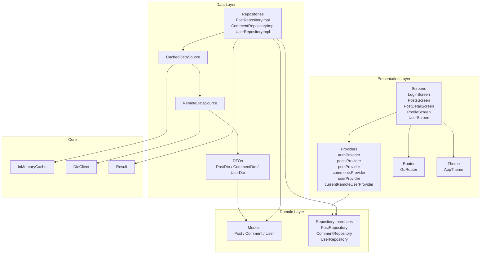
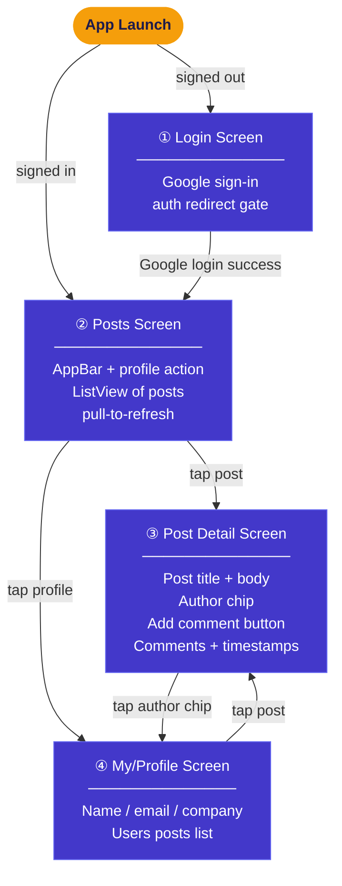
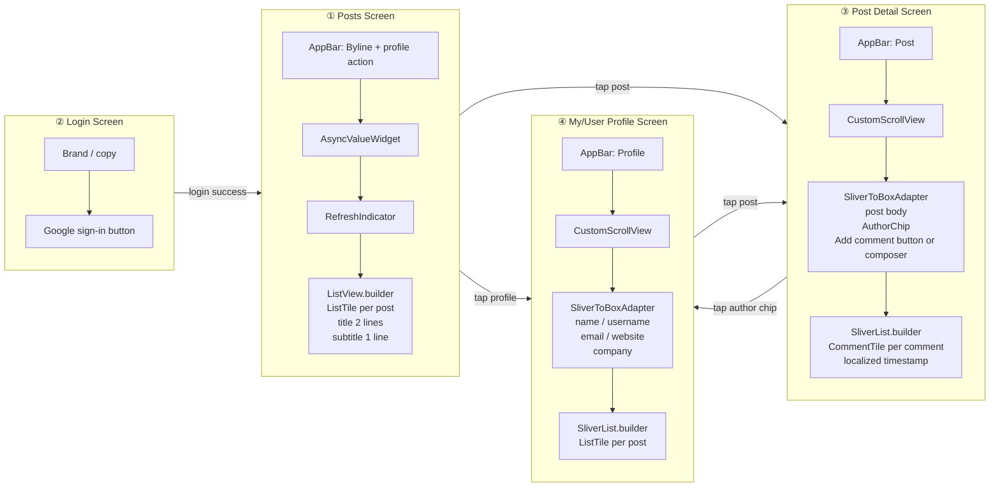
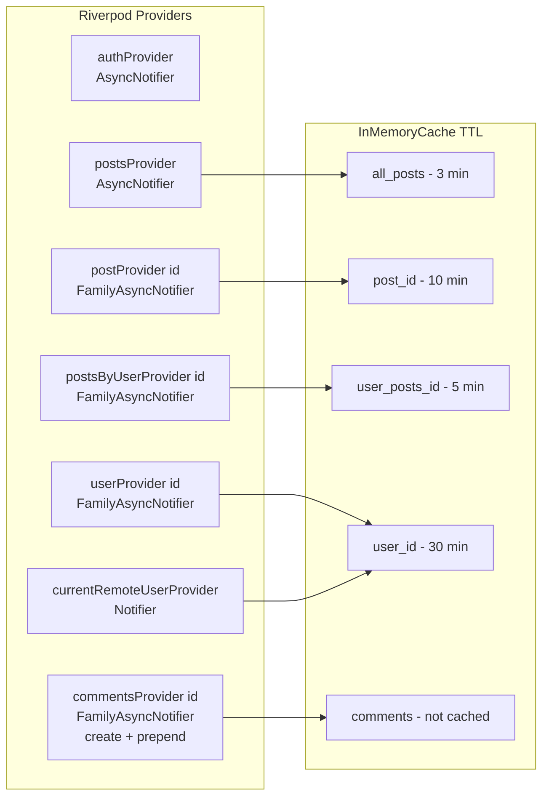
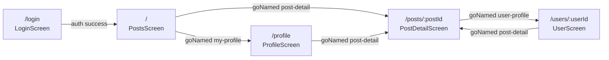

# Screen Flow Storyboard

## Dependency Graph

```mermaid
graph TD
    subgraph Presentation["Presentation Layer"]
        UI["Screens<br/>LoginScreen<br/>PostsScreen<br/>PostDetailScreen<br/>ProfileScreen<br/>UserScreen"]
        PROV["Providers<br/>authProvider<br/>postsProvider<br/>postProvider<br/>commentsProvider<br/>userProvider<br/>currentRemoteUserProvider"]
        ROUTER["Router<br/>GoRouter"]
        THEME["Theme<br/>AppTheme"]
    end

    subgraph Data["Data Layer"]
        REPO["Repositories<br/>PostRepositoryImpl<br/>CommentRepositoryImpl<br/>UserRepositoryImpl"]
        CDS["CachedDataSource"]
        RDS["RemoteDataSource"]
        DTOS["DTOs<br/>PostDto / CommentDto / UserDto"]
    end

    subgraph Core["Core"]
        CACHE["InMemoryCache"]
        DIO["DioClient"]
        RESULT["Result"]
    end

    subgraph Domain["Domain Layer"]
        MODELS["Models<br/>Post / Comment / User"]
        IFACE["Repository Interfaces<br/>PostRepository<br/>CommentRepository<br/>UserRepository"]
    end

    UI --> PROV
    UI --> ROUTER
    UI --> THEME
    PROV --> IFACE
    REPO --> CDS
    CDS --> RDS
    CDS --> CACHE
    RDS --> DIO
    RDS --> DTOS
    DTOS --> MODELS
    REPO --> RESULT
    REPO --> IFACE
    REPO --> MODELS
```

---

## Navigation Flow

```mermaid
flowchart TD
    LAUNCH([App Launch]):::entry
    LOGIN["① Login Screen<br/>──────────────<br/>Google sign-in<br/>auth redirect gate"]:::screen
    POSTS["② Posts Screen<br/>──────────────<br/>AppBar + profile action<br/>ListView of posts<br/>pull-to-refresh"]:::screen
    DETAIL["③ Post Detail Screen<br/>──────────────<br/>Post title + body<br/>Author chip<br/>Add comment button<br/>Comments + timestamps"]:::screen
    PROFILE["④ My/Profile Screen<br/>──────────────<br/>Name / email / company<br/>Users posts list"]:::screen

    LAUNCH -->|signed out| LOGIN
    LAUNCH -->|signed in| POSTS
    LOGIN -->|"Google login success"| POSTS
    POSTS  -->|"tap post"| DETAIL
    POSTS  -->|"tap profile"| PROFILE
    DETAIL -->|"tap author chip"| PROFILE
    PROFILE -->|"tap post"| DETAIL

    classDef entry   fill:#F59E0B,color:#1E1B4B,stroke:#F59E0B,font-weight:bold
    classDef screen  fill:#4338CA,color:#fff,stroke:#6366F1
```

---

## Screen Details

```mermaid
flowchart LR
    subgraph S1["① Posts Screen"]
        direction TB
        A1["AppBar: Byline + profile action"]
        A2["AsyncValueWidget"]
        A3["RefreshIndicator"]
        A4["ListView.builder<br/>ListTile per post<br/>title 2 lines<br/>subtitle 1 line"]
        A1 --> A2 --> A3 --> A4
    end

    subgraph S2["② Login Screen"]
        direction TB
        L1["Brand / copy"]
        L2["Google sign-in button"]
        L1 --> L2
    end

    subgraph S3["③ Post Detail Screen"]
        direction TB
        B1["AppBar: Post"]
        B2["CustomScrollView"]
        B3["SliverToBoxAdapter<br/>post body<br/>AuthorChip<br/>Add comment button or composer"]
        B4["SliverList.builder<br/>CommentTile per comment<br/>localized timestamp"]
        B1 --> B2 --> B3 --> B4
    end

    subgraph S4["④ My/User Profile Screen"]
        direction TB
        C1["AppBar: Profile"]
        C2["CustomScrollView"]
        C3["SliverToBoxAdapter<br/>name / username<br/>email / website<br/>company"]
        C4["SliverList.builder<br/>ListTile per post"]
        C1 --> C2 --> C3 --> C4
    end

    S2 -->|login success| S1
    S1 -->|tap post| S3
    S1 -->|tap profile| S4
    S3 -->|tap author chip| S4
    S4 -->|tap post| S3
```

---

## State & Caching

```mermaid
flowchart LR
    subgraph Providers["Riverpod Providers"]
        P0["authProvider<br/>AsyncNotifier"]
        P1["postsProvider<br/>AsyncNotifier"]
        P2["postProvider id<br/>FamilyAsyncNotifier"]
        P3["commentsProvider id<br/>FamilyAsyncNotifier<br/>create + prepend"]
        P4["userProvider id<br/>FamilyAsyncNotifier"]
        P5["postsByUserProvider id<br/>FamilyAsyncNotifier"]
        P6["currentRemoteUserProvider<br/>Notifier"]
    end

    subgraph Cache["InMemoryCache TTL"]
        C1["all_posts - 3 min"]
        C2["post_id - 10 min"]
        C3["user_posts_id - 5 min"]
        C4["user_id - 30 min"]
        C5["comments - not cached"]
    end

    P1 --> C1
    P2 --> C2
    P3 --> C5
    P4 --> C4
    P5 --> C3
    P6 --> C4
```

---

## Route Map

```mermaid
flowchart LR
    R0["/login<br/>LoginScreen"]
    R1["/<br/>PostsScreen"]
    R2["/posts/:postId<br/>PostDetailScreen"]
    R3["/profile<br/>ProfileScreen"]
    R4["/users/:userId<br/>UserScreen"]

    R0 -->|"auth success"| R1
    R1 -->|"goNamed post-detail"| R2
    R1 -->|"goNamed my-profile"| R3
    R2 -->|"goNamed user-profile"| R4
    R3 -->|"goNamed post-detail"| R2
    R4 -->|"goNamed post-detail"| R2
```
